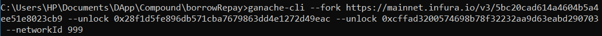
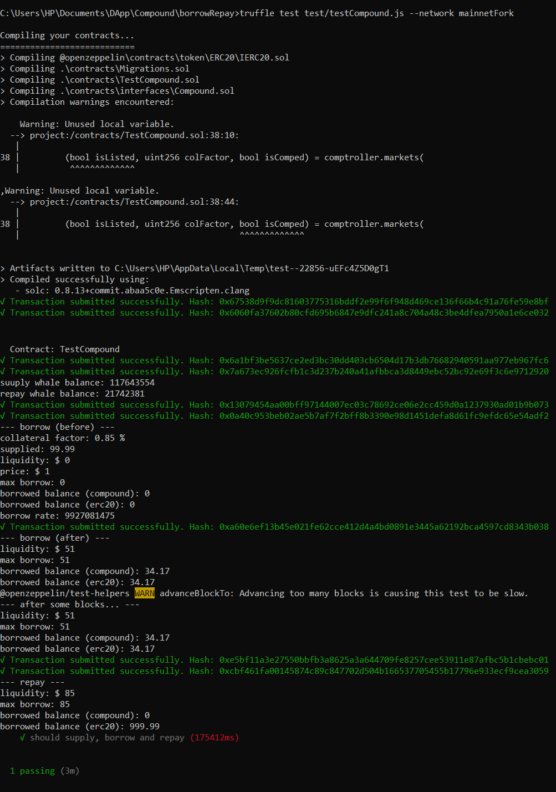

## Supply & Borrow & Repay - Compound Protocol 
The token that is used for supplying to the Compound protocol is USDC.  
After supplying USDC tokens to compound , we are able to borrow a percentage of what we've supplied , this is called collateral factor.  
function `getaccountliquidity()` => calculates how much can I borrow.  
function `getPriceFeed()` => get the price of token that we want to borrow in terms of US Dollar.  
The first step to borrow a token  is to enter the market for the token that we supplied so we enter market by function `borrow()`.  
After enough time elapsed , to repay borrow amount including interest we call  function `repay()`.  

## run the test using ganache-cli  
1) Call command below in CMD to run ganache on the mainnet fork:  

Now ganache is running on the mainnet fork.  

2) Open a new terminal and call command below:  

we succesfully supplied,borrowed and repaid to compound protocol.  