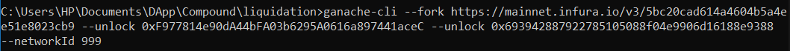
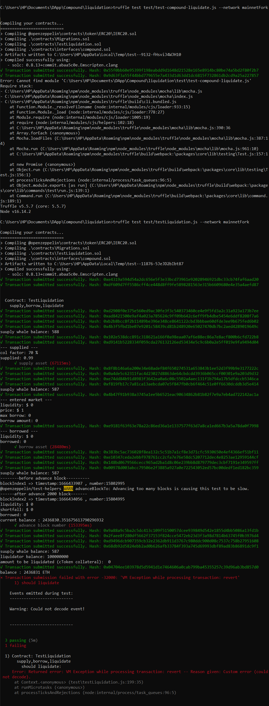

## Liquidate on Compound Protocol  
on Compound when you borrow more than  what you supplied , you are subject to liquidation . this means that someone else can repay a portion of the token you've borrowed and in return that person receives the token that you supplied at a discount .  
The token that is used for supplying to the Compound protocol is WBTC.  
By calling function `supply()` , it will lend our token to compound protocol.  
then we borrow up to max amount and our account becomes subjected to liquidation.  
After enough time elapsed (by using function `time.advanceBlockTo(BLOCK_NUMBER)`) , we are undercollateralized (we borrowed more than {`suppliedBalance` * `collateralFactor`}) , we call `liquidate()` from another contract called **TestLiquidator**.  

### more explanation provided by Compound documentation
A user who has negative account liquidity is subject to liquidation by other users of the protocol to return his/her account liquidity back to positive (i.e. above the collateral requirement). When a liquidation occurs, a liquidator may repay some or all of an outstanding borrow on behalf of a borrower and in return receive a discounted amount of collateral held by the borrower; this discount is defined as the liquidation incentive. A liquidator may close up to a certain fixed percentage (i.e. close factor) of any individual outstanding borrow of the underwater account. Unlike in v1, liquidators must interact with each cToken contract in which they wish to repay a borrow and seize another asset as collateral. When collateral is seized, the liquidator is transferred cTokens, which they may redeem the same as if they had supplied the asset themselves. Users must approve each cToken contract before calling liquidate (i.e. on the borrowed asset which they are repaying), as they are transferring funds into the contract.  

## run the test using ganache-cli  
1) Call command below in CMD to run ganache on the mainnet fork  

Now ganache is running on the mainnet fork  

2) Open a new terminal and call command below   

All the steps passed successfully execpt final step . I think the ERROR is because liquidation on Coumpound V2 is paused according to Compound Governance Proposal 57 that has been executed on August 28th, 2021.  
So currently I'm working on this ERROR to fix it !  