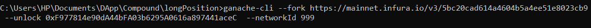
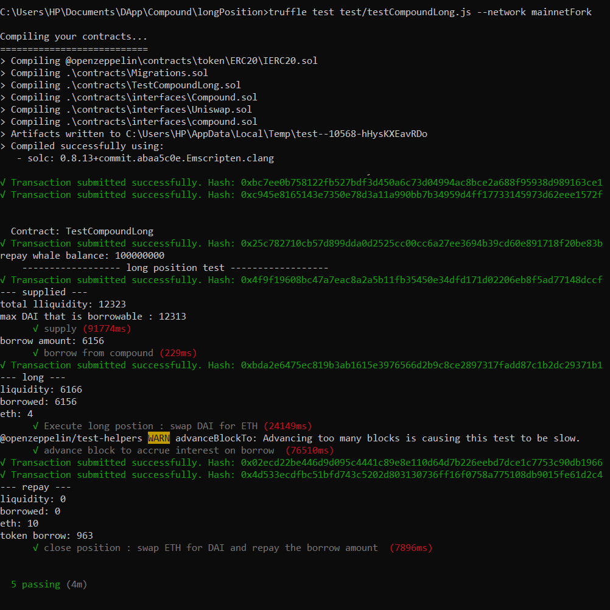

## Long position - Compound Protocol 
In this code I will long ETH using Compound and Uniswap. The steps are as below :  
    * supply ETH to Compound  
    * borrow DAI from Compound  
    * buy ETH in Uniswap using DAI that we borrowed from Compound  
    * when the price of ETH goes up , it's time to close the position! so we follow steps below :  
    * swap ETH for DAI in Uniswap  
    * repay borrowed DAI  
    * redeem supplied ETH  

## run the test using ganache-cli  
1) Call command below in CMD to run ganache on the mainnet fork:  

Now ganache is running on the mainnet fork.  

2) Open a new terminal and call command below:  

Notice that the interest on borrow is always accumulating so your borrow balance is always increasing , so if the price of ETH either goes down or doesn't goes up quickly enough, then at some points you have to make a decision either to close your position at the lost or keep on waiting in hopes that the  price of ETH goes up .  