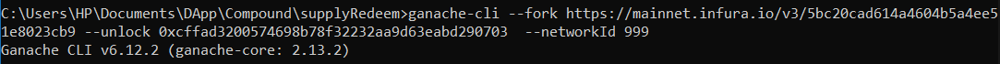
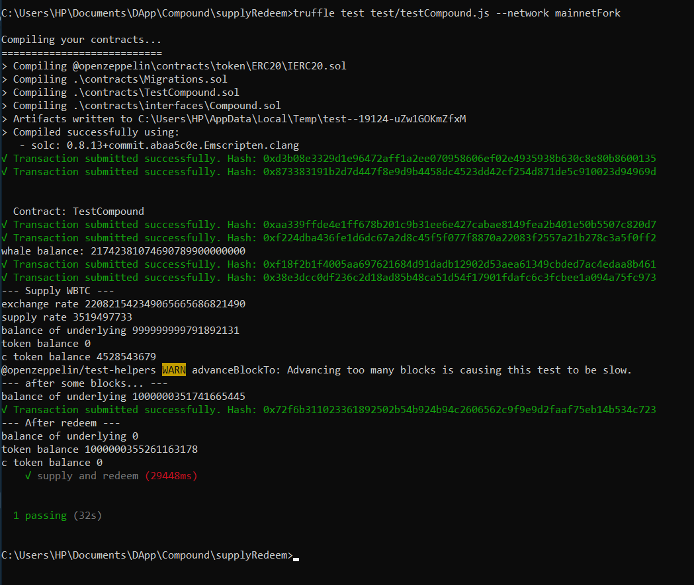

## Supply & Redeem - Compound Protocol 
The token that is used for supplying to the Compound protocol is DAI.  
cToken in test represents CDAI contract and is the token that you get back when you lend DAI to compound protocol .  
By calling function `supply()` , it will lend our token to compound protocol.  
After enough time elapsed to redeem our token (withdraw the token that we supplied to compound ) we call function `redeem()` on the cToken contract  .  

## run the test using ganache-cli  
1) Call command below in CMD to run ganache on the mainnet fork 

Now ganache is running on the mainnet fork 

2) Open a new terminal and call command below 

